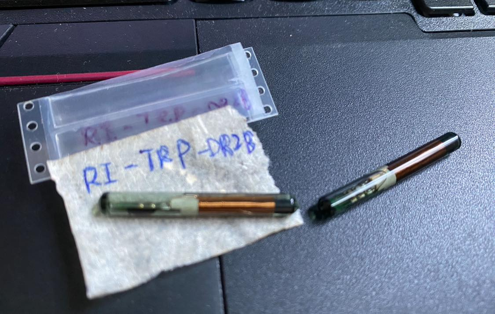

# RFID_TI_glass_tube_RI-TRP-DR2B_testing

  

TI glass tube RFID device, TI P/N RI-TRP-DR2B

https://www.ti.com/product/zh-tw/RI-TRP-DR2B  

Frequency range 134.2 kHz  
Standard TI protocol  
Operating temperature range (°C) -25 to 85  
Rating Catalog  
Transmission principle HDX - FSK  

Best-in-class performance through patented half-duplex (HDX) technology  
Patented transponder tuning provides stable and high read and write performance  
MPT (Muitl Page Transponder) 1360-bit type  
ISO 11784 and ISO 11785 compliant  
Insensitive to almost all nonmetallic materials  

TI 32-mm glass transponders provide superior performance and operate at a resonance frequency of 134.2 kHz. Specific products are compliant to ISO 11784 and ISO 11785 global open standards. TI LF transponders are manufactured with TI’s patented tuning process to provide consistent read and write performance. Before delivery, the transponders undergo complete functional and parametric testing to provide the high quality that customers have come to expect from TI. The transponder is well suited for use in a broad range of applications including, but not limited to, access control, vehicle identification, container tracking, asset management, and waste management applications.
